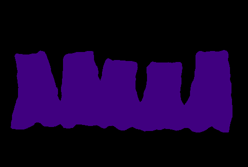

# DeepLab-ResNet-TensorFlow

This is an (re-)implementation of [DeepLab-ResNet](http://liangchiehchen.com/projects/DeepLabv2_resnet.html) in TensorFlow for semantic image segmentation on any parsing dataset.


## Model Description

The DeepLab-ResNet is built on a fully convolutional variant of [ResNet-101](https://github.com/KaimingHe/deep-residual-networks) with [atrous (dilated) convolutions](https://github.com/fyu/dilation), atrous spatial pyramid pooling, and multi-scale inputs.

The model is trained on a mini-batch of images and corresponding ground truth masks with the softmax classifier at the top. During training, the masks are downsampled to match the size of the output from the network; during inference, to acquire the output of the same size as the input, bilinear upsampling is applied. The final segmentation mask is computed using argmax over the logits.
Optionally, a fully-connected probabilistic graphical model, namely, CRF, can be applied to refine the final predictions.
On the test set of PASCAL VOC, the model achieves <code>79.7%</code> of mean intersection-over-union.

For more details on the underlying model please refer to the following paper:


    @article{CP2016Deeplab,
      title={DeepLab: Semantic Image Segmentation with Deep Convolutional Nets, Atrous Convolution, and Fully Connected CRFs},
      author={Liang-Chieh Chen and George Papandreou and Iasonas Kokkinos and Kevin Murphy and Alan L Yuille},
      journal={arXiv:1606.00915},
      year={2016}
    }


## Requirements

TensorFlow needs to be installed before running the scripts.
TensorFlow v1.1.0 is supported; for TensorFlow v0.12 please refer to this [branch](https://github.com/DrSleep/tensorflow-deeplab-resnet/tree/tf-0.12); for TensorFlow v0.11 please refer to this [branch](https://github.com/DrSleep/tensorflow-deeplab-resnet/tree/tf-0.11). Note that those branches may not have the same functional as the current master. 

To install the required python packages (except TensorFlow), run
```bash
pip install -r requirements.txt
```
or for a local installation
```bash
pip install --user -r requirements.txt
```

## Dataset and Training


The training script allows to monitor the progress in the optimisation process using TensorBoard's image summary. Besides that, one can also exploit random scaling and mirroring of the inputs during training as a means for data augmentation. For example, to train the model from scratch with random scale and mirroring turned on, simply run:
```bash
python train_msc.py
```


## Evaluation

The single-scale model shows <code>86.9%</code> mIoU on the Pascal VOC 2012 validation dataset (['SegmentationClassAug'](https://www.dropbox.com/s/oeu149j8qtbs1x0/SegmentationClassAug.zip?dl=0)). No post-processing step with CRF is applied.

The following command provides the description of each of the evaluation settings:
```bash
python evaluate_msc.py
```

To apply CRF processing in evaluation run the following command:
```bash
python evaluate_msc_with_CRF.py
```

## Inference

To perform inference over your own images, use the following command:
```bash
python inference.py /path/to/your/image /path/to/ckpt/file
```
This will run the forward pass and save the resulted mask with this colour map:
</img>
</img>

## Using your dataset

In order to apply the same scripts using your own dataset, you would need to follow the next steps:

0. Make sure that your segmentation masks are in the same format as the ones in the DeepLab setup (i.e., without a colour map). This means that if your segmentation masks are RGB images, you would need to convert each 3-D RGB vector into a 1-D label. For example, take a look [here](https://gist.github.com/DrSleep/4bce37254c5900545e6b65f6a0858b9c);
1. Create a file with instances of your dataset in the same format as in files [here](https://github.com/DrSleep/tensorflow-deeplab-resnet/tree/master/dataset);
2. Change the flags `data-dir` and `data-list` accordingly in thehttps://gist.github.com/DrSleep/4bce37254c5900545e6b65f6a0858b9c); script file that you will be using (e.g., `python train.py --data-dir /my/data/dir --data-list /my/data/list`);
3. Change the `IMG_MEAN` vector accordingly in the script file that you will be using;
4. For visualisation purposes, you will also need to change the colour map [here](https://github.com/DrSleep/tensorflow-deeplab-resnet/blob/master/deeplab_resnet/utils.py);
5. Change the flags `num-classes` and `ignore-label` accordingly in the script that you will be using (e.g., `python train.py --ignore-label 255 --num-classes 21`).
6. If restoring weights from the `PASCAL` models for your dataset with a different number of classes, you will also need to pass the `--not-restore-last` flag, which will prevent the last layers of size <code>21</code> from being restored.

